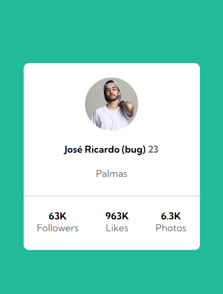

# Profile Card

Essa é a solução da realização de um Profile Card proposto pelo curso DevQuest, em alternativa ao desafio [Frontend Mentor | Profile card component coding challenge](https://www.frontendmentor.io/challenges/profile-card-component-cfArpWshJ)

## Desafio 
Criar um cartão que contenha as informações de perfil, para ser aprimorado as habilidades de posicionamento de elementos usando flexbox.

Para dar mais personalidade ao desafio, coloquei minhas informações, ao invés de manter os dados do desafio.

## Screenshots

Versão para desktop

Versão para mobile

## Tecnologias utilizadas

- HTML
- CSS
- Flexbox

